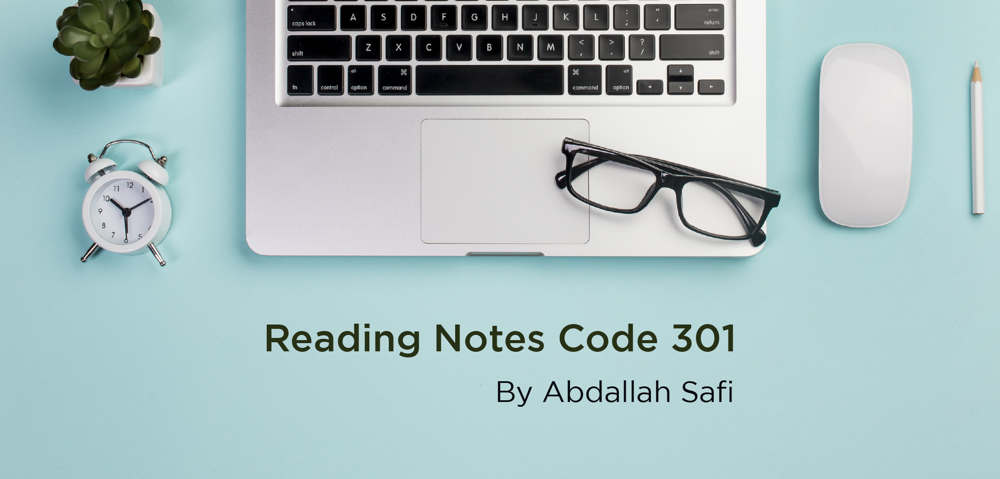

# Code 301 Reading Notes

Here I put my notes, which I collect when I read the web development topics required of me during code 301.

## Table of content

Read Num | Read title | Read link
------------ | ------------- | --------------
01 |  SMACSS and Responsive Web Design | [Click here](https://abdallahsafi.github.io/reading-notes-301/class-01)

> “Each of us is a unique strand in the intricate web of life and here to make a contribution.”
> ― Deepak Chopra

